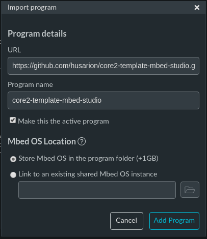
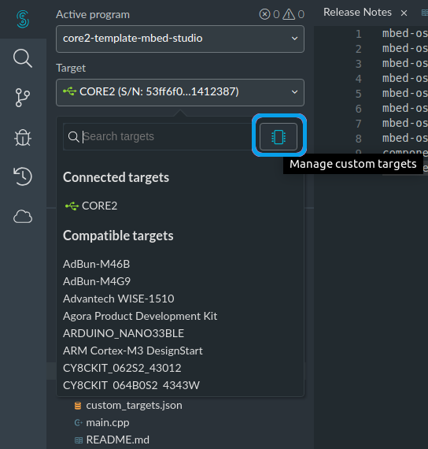
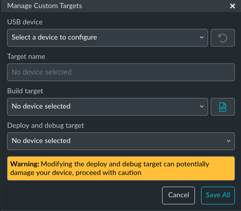
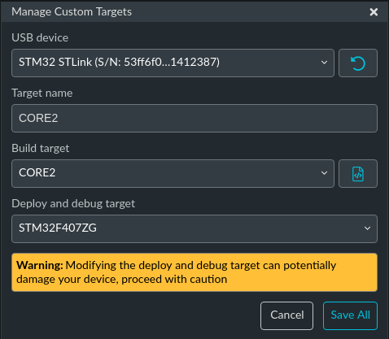
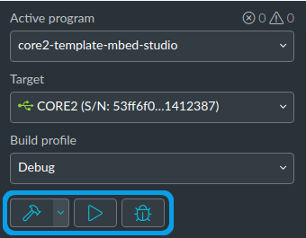

# Blinky Mbed OS example

The example project is part of the [Arm Mbed OS Official Examples](https://os.mbed.com/code/) and is the [getting started example for Mbed OS](https://os.mbed.com/docs/mbed-os/v5.14/quick-start/index.html). It contains an application that repeatedly blinks an LED on the Mbed OS supporting boards.

This template contains configuration files for **CORE2** target.

## Mbed Studio IDE installation and configuration

To install the Mbed Studio IDE follow instructions from this manual: 
* https://os.mbed.com/docs/mbed-studio/current/installing/installing-mbed-studio.html

We recommend you to switch default compiler to **Arm Embedded GCC Compiler 9-2019-q4-major**. Instruction on how to do that can be found here: 
* https://os.mbed.com/docs/mbed-studio/current/installing/switching-to-gcc.html

## Importing a Blinky program

* Open [Mbed Studio](https://os.mbed.com/studio/) IDE. 
* From menu select `File -> Import Program...` 
* In **Import program** dialog box paste link to this repository. 
* In **Mbed OS Location** select first option if you want to download a new copy of Mbed OS and store it in your program folder. In case you want to share single instance of the Mbed OS library among many programs download it to a known location and proceed with the option number two. 
* Finalize the import by clicking **Add Program**.

  

## Selecting a custom build target

* Attach your ST-LINK probe to CORE2, power-up the board and connect the programmer to your computer. 
* Open **Target** drop-down list and click on **Mangage custom targets** button.

  

Following dialog box should appear:

  

* From the **USB device** drop-down list choose the detected ST-LINK probe. 
* From the **Build target** drop-down list choose the **CORE2** target. Remaining fields should populate automatically.

  

* Save the configuration with **Save all**.

## Building and running

* From the **Build profile** drop-down list select one of the profiles:
    * Debug (default)
    * Develop
    * Release

* Clicking the **hammer** icon will compile your project and generate `bin` file.
* Clicking on the **play** icon will build the example and flash it to the connected board.
* Clicking the **bug** icon will start debug session.

  

## Application functionality

The `main()` function is the single thread in the application. It toggles the state of a digital output connected to an LED on the board.

## Expected output
The LED on your target turns on and off every 500 milliseconds.

## Troubleshooting
If you have problems, you can review the [documentation](https://os.mbed.com/docs/latest/tutorials/debugging.html) for suggestions on what could be wrong and how to fix it.

## Related Links

* [Mbed OS Stats API](https://os.mbed.com/docs/latest/apis/mbed-statistics.html).
* [Mbed OS Configuration](https://os.mbed.com/docs/latest/reference/configuration.html).
* [Mbed OS Serial Communication](https://os.mbed.com/docs/latest/tutorials/serial-communication.html).
* [Mbed OS bare metal](https://os.mbed.com/docs/mbed-os/latest/reference/mbed-os-bare-metal.html).
* [Mbed boards](https://os.mbed.com/platforms/).

### License and contributions

The software is provided under Apache-2.0 license. Contributions to this project are accepted under the same license. Please see contributing.md for more info.

This project contains code from other projects. The original license text is included in those source files. They must comply with our license guide.
